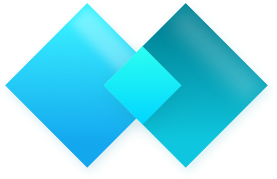

<div align="center">
  <br>
  <br>
  

  <br>
</div>

# Diffr

> Create and share diffs with Diffr, the privacy focused online text diffing tool.

This is the source code repository of the Diffr app. You can find the app at [loilo.github.io/diffr](https://loilo.github.io/diffr/).
Updated.

## Technologies

The core technologies this project uses are:

<!-- prettier-ignore -->
Technology | Purpose
-|-
**[Monaco Editor](https://microsoft.github.io/monaco-editor/)** | A text/code editor by Microsoft, used for the editing and diffing area itself.
**[NuxtJS](https://nuxtjs.org/)** | An application framework for Vue.js, used for prerendering, PWA support and overall application structure.
**[`lz-string`](https://www.npmjs.com/package/lz-string)** | A quick and space-efficient compression algorithm, used for serializing the current app state in the URL anchor in as few characters as possible.
**[GitHub Pages](https://pages.github.com/)** | This app does (purposefully) not generate any income. Therefore, free hosting is essential to keep it running.

## Setup

Clone this repository and install its dependencies using [yarn](https://yarnpkg.com/).

```bash
yarn install
```

## Local Development

Start a local dev server with hot reloading:

```bash
yarn dev
```

## Generate Production Site

Create a production-ready site in the `dist` folder:

```
yarn build
```
